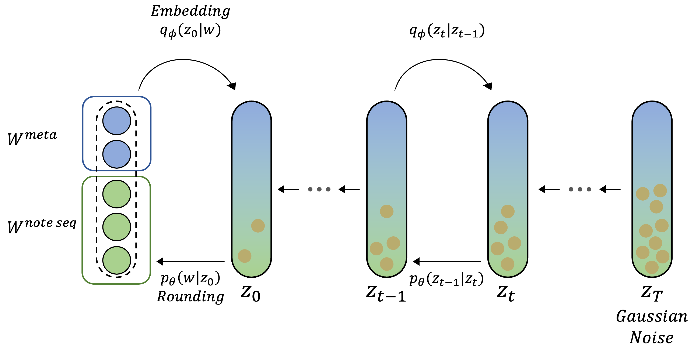
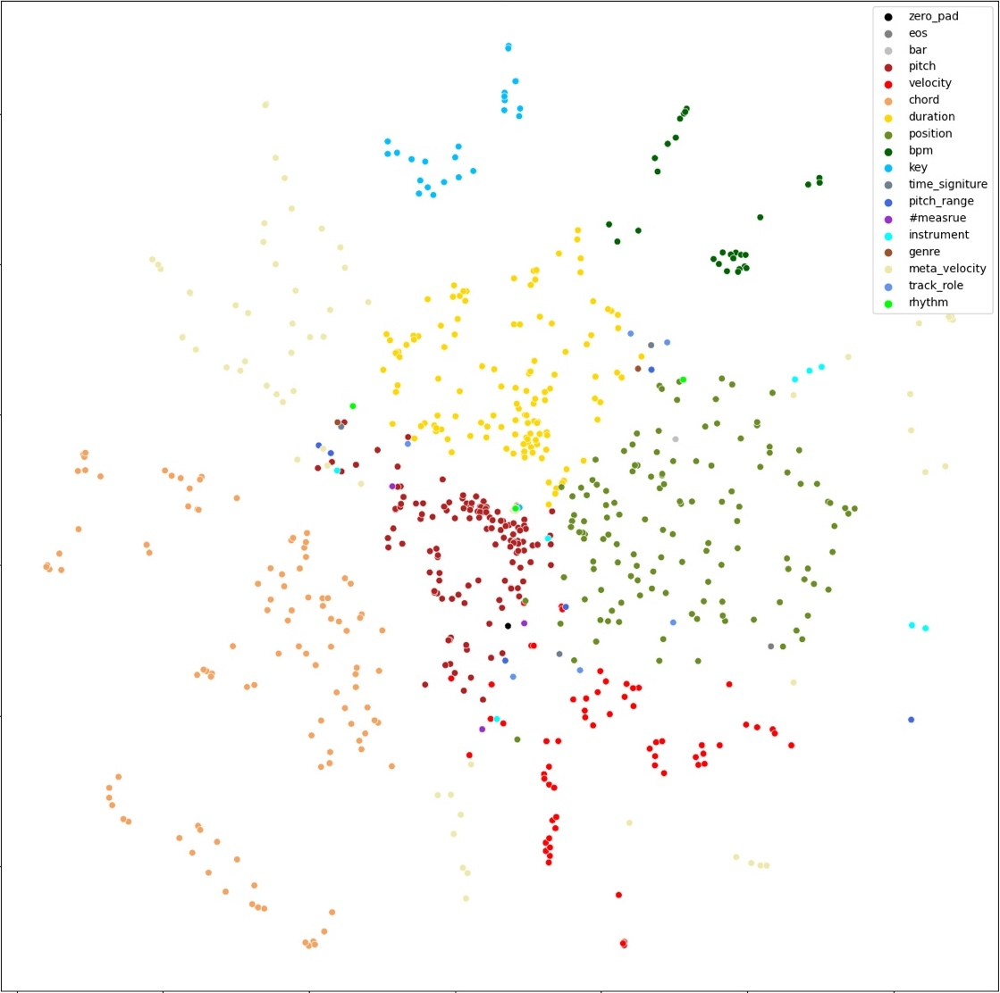
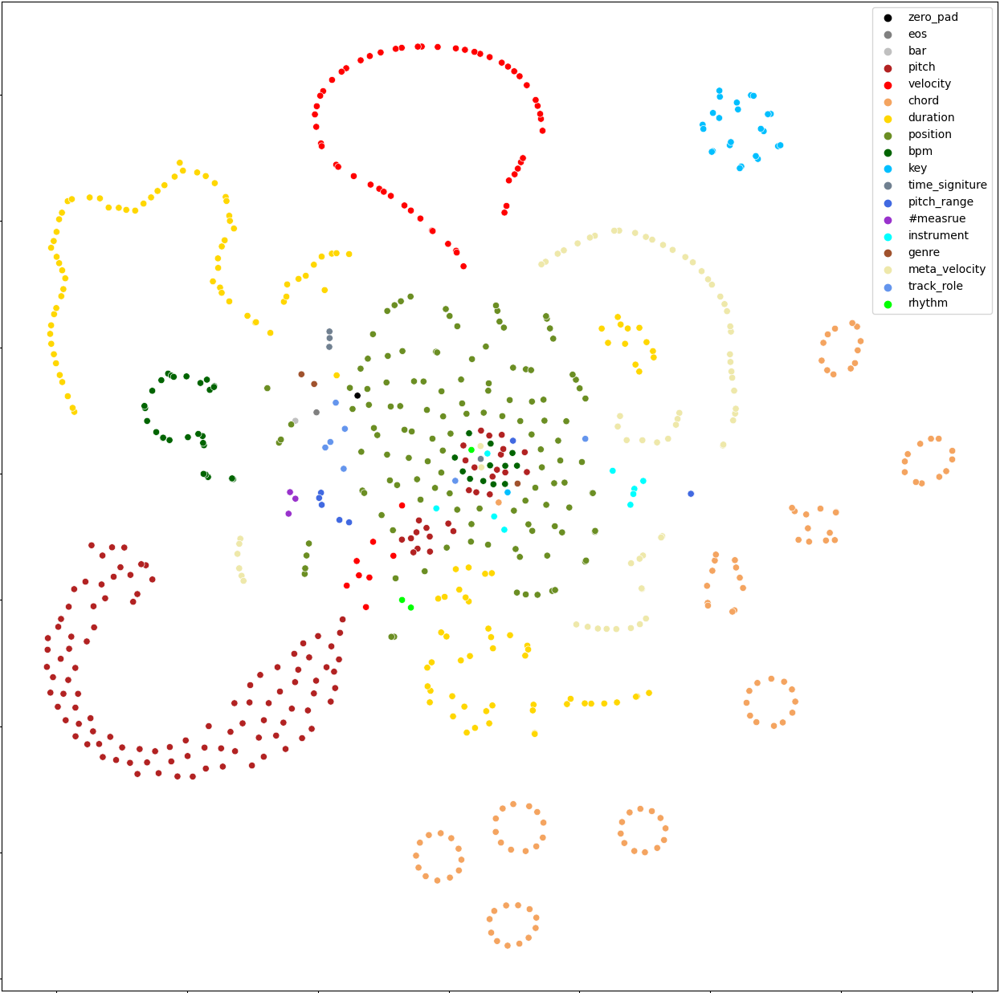
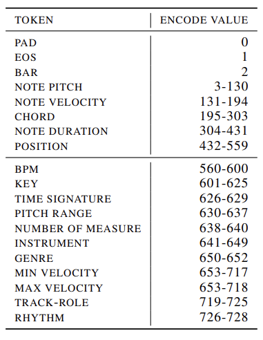
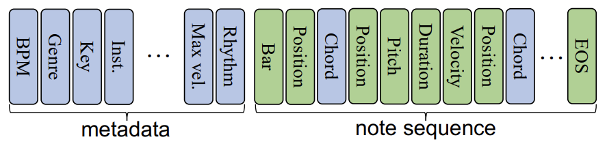
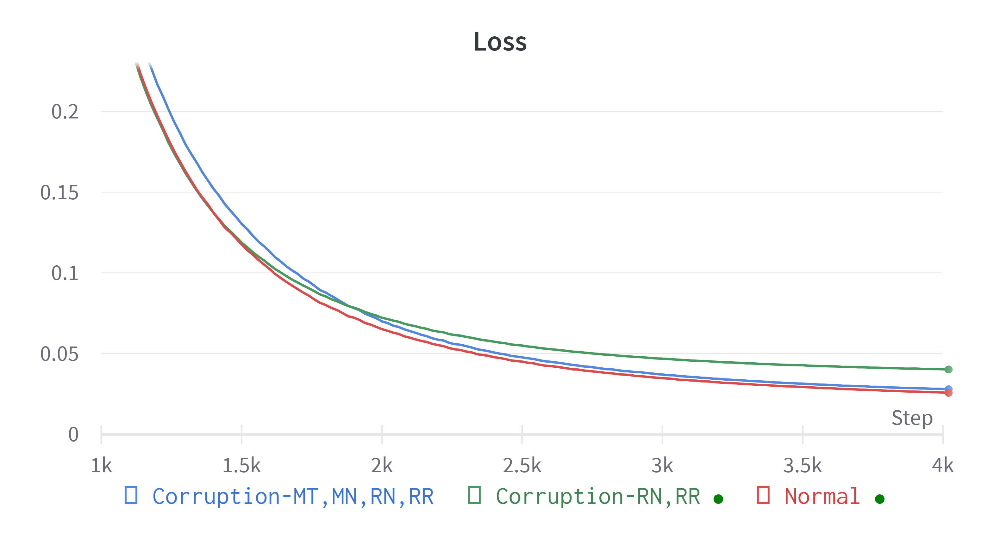

<!-- HEADER START -->
<!-- src: https://github.com/kyechan99/capsule-render -->
<p align="center"><a href="#">
    
</a></p>
<h3 align="center">Music generation from Unclear midi SEquence with Diffusion model</h3>
<p align="center"><a href="https://github.com/YAIxPOZAlabs"></a></p>
<p align="center">This project was carried out by <b><a href="https://github.com/yonsei-YAI">YAI 11th</a></b>, in cooperation with <b><a href="https://github.com/POZAlabs">POZAlabs</a></b>.</p>
<p align="center">
<br>
<a href="mailto:dhakim@yonsei.ac.kr">
    
</a>
<a href="https://dhakim.notion.site/1e7dc19fd1064e698a389f75404883c7">
    
</a>
<a href="./README.pdf">
    
</a>
</p>
<p align="center">
<br>
<a href="./README.pdf">
🔎 For the details, please refer to <b>Project Full Report</b>.
</a>
</p>
<br>
<hr>
<!-- HEADER END -->

<h3 align="center"><br>✨&nbsp; Contributors&nbsp; ✨<br><br></h3>
<p align="center">
<b>🛠️ <a href="https://github.com/kdha0727">KIM DONGHA</a></b>&nbsp; :&nbsp; YAI 8th&nbsp; /&nbsp; AI Dev Lead &nbsp;&nbsp;&nbsp;&nbsp;&nbsp;<br>
<b>&nbsp;&nbsp;&nbsp;&nbsp;&nbsp;&nbsp;&nbsp;🚀 <a href="https://github.com/ta3h30nk1m">KIM TAEHEON</a></b>&nbsp; :&nbsp; YAI 10th&nbsp; /&nbsp; AI Research & Dev <br>
<b>👑 <a href="https://github.com/san9min">LEE SANGMIN</a></b>&nbsp; :&nbsp; YAI 9th&nbsp; /&nbsp; Team Leader&nbsp;&nbsp;&nbsp;&nbsp;&nbsp; <br>
&nbsp;<b>🐋 <a href="https://github.com/Tim3s">LEE SEUNGJAE</a></b>&nbsp; :&nbsp; YAI 9th&nbsp; /&nbsp; AI Research Lead <br>
<b>🌈 <a href="https://github.com/jeongwoo1213">CHOI JEONGWOO</a></b>&nbsp; :&nbsp; YAI 10th&nbsp; /&nbsp; AI Research & Dev <br>
<b>🌟 <a href="https://github.com/starwh03">CHOI WOOHYEON</a></b>&nbsp; :&nbsp; YAI 10th&nbsp; /&nbsp; AI Research & Dev <br>
<br><br>
<hr>

<h3 align="center"><br>🎼 Generated Samples 🎵<br><br></h3>

<div align="center">

https://user-images.githubusercontent.com/61076953/223916377-c4c317b5-66dc-49a0-b42a-20132f638128.mp4

</div>


<br><hr>

<h2> How to run</h2>

<h3>0. Clone repository and cd</h3>

```bash
git clone https://github.com/YAIxPOZAlabs/MuseDiffusion.git
cd MuseDiffusion
```

<br>
<h3>1. Prepare environment and data</h3>

<h4>Set environment with python 3.8 and install pytorch</h4>

```bash
python3 -m pip install virtualenv && \
python3 -m virtualenv venv --python=python3.8 && \
source venv/bin/activate && \
pip3 install -r requirements.txt
```

<details>
<summary>(Optional) If required, install python 3.8 for venv usage.</summary>
&nbsp;

```bash
sudo apt update && \
sudo apt install -y software-properties-common && \
sudo add-apt-repository -y ppa:deadsnakes/ppa && \
sudo apt install -y python3.8 python3.8-distutils
```

</details>

<details>
<summary>(Optional) If anaconda is available, you can set environments by anaconda instead of given code.</summary>
&nbsp;

```bash
conda create -n MuseDiffusion python=3.8 pip wheel
conda activate MuseDiffusion
pip3 install -r requirements.txt
```

</details>

<details>
<summary>(Recommended) <b>If docker is available, use Dockerfile instead</b>.</summary>
&nbsp;

```bash
docker build -f Dockerfile -t musediffusion:v1 .
```

</details>

<br>
<h3>2. Download and Preprocess dataset</h3>

```bash
python3 -m MuseDiffusion dataprep
```

<details>
<summary>After this step, your directory structure would be like:</summary>
&nbsp;

```
MuseDiffusion
├── MuseDiffusion
│   ├── __init__.py
│   ├── config
│   │   ├── __init__.py
│   │   ├── __main__.py
│   │   └── base.py
│   ├── data
│   │   ├── __init__.py
│   │   ├── __main__.py
│   │   ├── corruption.py
│   │   └── ...
│   ├── models
│   │   ├── __init__.py
│   │   ├── denoising_model.py
│   │   ├── gaussian_diffusion.py
│   │   ├── nn.py
│   │   └── ...
│   ├── run
│   │   ├── __init__.py
│   │   ├── sample_generation.py
│   │   ├── sample_seq2seq.py
│   │   └── train.py
│   └── utils
│       ├── __init__.py
│       ├── decode_util.py
│       ├── dist_util.py
│       ├── train_util.py
│       └── ...
├── assets
│   └── (files for readme...)
├── commu
│   └── (same code as https://github.com/POZAlabs/ComMU-code/blob/master/commu/)
├── datasets
│   └── ComMU-processed
│       └── (preprocessed commu dataset files...)
├── scripts
│   ├── run_train.sh
│   ├── sample_seq2seq.sh
│   └── sample_generation.sh
├── README.md
└── requirements.txt
```

</details>

<br>
<h3>3. Prepare model weight and configuration</h3>

<h4>With downloading pretrained one</h4>

```bash
mkdir diffusion_models
mkdir diffusion_models/pretrained_weights
cd diffusion_models/pretrained_weights
wget https://github.com/YAIxPOZAlabs/MuseDiffusion/releases/download/1.0.0/pretrained_weights.zip
unzip pretrained_weights.zip && rm pretrained_weights.zip
cd ../..
```

<h4>With Manual Training</h4>

```bash
python3 -m MuseDiffusion train --distributed
```

<details>
<summary>How to customize arguments</summary>

<h5>&nbsp; Method 1: Using JSON Config File</h5>

* With `--config_json train_cfg.json` required arguments above will be automatically loaded.

```bash
# Copy config file to root directory
python3 -c "from MuseDiffusion.config import TrainSettings as T; print(T().json(indent=2))" \
>> train_cfg.json

# Customize config on your own
vi train_cfg.json

# Run training script
python3 -m MuseDiffusion train --distributed --config_json train_cfg.json
```

<h5>&nbsp; Method 2:  Using Arguments</h5>

* Add your arguments refer to `python3 -m MuseDiffusion train --help`.

> Refer to example below:
```bash
python3 -m MuseDiffusion train --distributed \
--lr 0.0001 \
--batch_size 2048 \
--microbatch 64 \
--learning_steps 320000 \
--log_interval 20 \
--save_interval 1000 \
--eval_interval 500 \
--ema_rate 0.5,0.9,0.99 \
--seed 102 \
--diffusion_steps 2000 \
--schedule_sampler lossaware \
--noise_schedule sqrt \
--seq_len 2096 \
--pretrained_denoiser diffuseq.pt \
--pretrained_embedding pozalabs_embedding.pt \
--freeze_embedding false \
--use_bucketing true \
--dataset ComMU \
--data_dir datasets/ComMU-processed \
--data_loader_workers 4 \
--use_corruption true \
--corr_available mt,mn,rn,rr \
--corr_max 4 \
--corr_p 0.5 \
--corr_kwargs "{'p':0.4}" \
--hidden_t_dim 128 \
--hidden_dim 128 \
--dropout 0.4 \
--weight_decay 0.1 \
--gradient_clipping -1.0
```

</details>

<details>
<summary>With regard to <b><u>--distributed</u></b> argument (torch.distributed runner)</summary>

<h5>&nbsp; Arguments related with torch.distributed:</h5>

* Argument `--distributed` will run `python -m MuseDiffusion train` 
  **with torch.distributed runner**
  * you can customize options, or environs.
* commandline option `--nproc_per_node` - number of training node (GPU) to use.
  * default: number of GPU in `CUDA_VISIBLE_DEVICES` environ.
* commandline option `--master_port` - master port for distributed learning.
  * default: will automatically be found if available, otherwise `12233`
* environ `CUDA_VISIBLE_DEVICES` - specific GPU index. e.g: `CUDA_VISIBLE_DEVICES=4,5,6,7`
  * default: not set - in this case, trainer will use all available GPUs.
* environ `OPT_NUM_THREADS` - number of threads for each node.
  * default: will automatically be set to `$CPU_CORE` / / `$TOTAL_GPU`
* In windows, torch.distributed is disabled in default. 
  to enable, edit `USE_DIST_IN_WINDOWS` flag in `MuseDiffusion/utils/dist_util.py`.

> Refer to example below:
```bash
CUDA_VISIBLE_DEVICES=4,5,6,7 python3 -m MuseDiffusion train --distributed --master_port 12233
```

</details>

After training, weights and configs will be saved into `./diffusion_models/{name-of-model-folder}/`.

<br>
<h3>4. Sample with model - Modify or Generate Midi!</h3>

<h4>From corrupted samples</h4>

```bash
python3 -m MuseDiffusion modification --distributed \
--use_corruption True \
--corr_available rn,rr \
--corr_max 2 \
--corr_p 0.5 \
--step 500 \
--strength 0.75 \
--model_path ./diffusion_models/{name-of-model-folder}/{weight-file}
```
* You can use arguments for `torch.distributed`, which is same as training script.
* Type `python3 -m MuseDiffusion modification --help` for detailed usage.
* **You can omit `--model_path` argument, if you want to use pretrained weights.**

<h4>From metadata</h4>

```bash
python3 -m MuseDiffusion generation --distributed \
--bpm {BPM} \
--audio_key {AUDIO_KEY} \
--time_signature {TIME_SIGNATURE} \
--pitch_range {PITCH_RANGE} \
--num_measures {NUM_MEASURES} \
--inst {INST} \
--genre {GENRE} \
--min_velocity {MIN_VELOCITY} \
--max_velocity {MAX_VELOCITY} \
--track_role {TRACK_ROLE} \
--rhythm {RHYTHM} \
--chord_progression {CHORD_PROGRESSION} \
--num_samples 1000 \
--step 500 \
--model_path diffusion_models/{name-of-model-folder}/{weight-file}
```

* **In generation, MidiMeta arguments** (bpm, audio_key, ..., chord_progression) **are essential.**
* You can use arguments for `torch.distributed`, which is same as training script.
* Type `python3 -m MuseDiffusion generation --help` for detailed usage.
* **You can omit `--model_path` argument, if you want to use pretrained weights.**

<details>
<summary>Using MidiMeta JSON file, instead of arguments (Recommended than Commandline Input)</summary>
&nbsp;

```bash
python3 scripts/meta_json_generator.py  # This generates meta.json in git root.
```

```bash
# Alter {META_JSON_FILE_PATH} with meta.json
python3 -m MuseDiffusion generation --distributed \
--meta_json {META_JSON_FILE_PATH} \
--num_samples 1000 \
--step 500 \
--model_path diffusion_models/{name-of-model-folder}/{weight-file}
```

</details>

<details>
<summary>Example Commandline</summary>
&nbsp;

> Refer to example below:
```bash
python3 -m MuseDiffusion generation --distributed \
--num_samples 1000 \
--bpm 70 --audio_key aminor --time_signature 4/4 --pitch_range mid_high \
--num_measures 8 --inst acoustic_piano --genre newage \
--min_velocity 60 --max_velocity 80 --track_role main_melody --rhythm standard \
--chord_progression Am-Am-Am-Am-Am-Am-Am-Am-G-G-G-G-G-G-G-G-F-F-F-F-F-F-F-F-E-E-E-E-E-E-E-E-Am-Am-Am-Am-Am-Am-Am-Am-G-G-G-G-G-G-G-G-F-F-F-F-F-F-F-F-E-E-E-E-E-E-E-E
```

</details>

<br>

<hr>


## MuseDiffusion

<div align="center">
  
</div>

<br>
<p align="center"><b>MuseDiffusion</b> : <i>Diffusion model to modify and also generate midi data corresponding to the given meta information.</i></p>
<br>

We chose **[DiffuSeq](https://github.com/Shark-NLP/DiffuSeq)** as the baseline 
and use **[ComMU dataset](https://github.com/POZAlabs/ComMU)**, where meta and midi are tokenized and paired. 
Discrete meta and midi datas are projected input into continuous domain using embedding function. 
We trained the diffusion model and embedding weights jointly 
and let the MUSE-Diffusion to understand the relation between meta and midi.

<br>

**Forward Process**

An embedding function, called $\text{EMB}$, maps the discrete meta-midi tokens into a continuous space 
and this allows MUSE-Diffusion to learn a unified feature space of $w^{\text{meta}}$ and $w^{\text{note seq}}$ . 
And we also add a new Gaussian transition 
$q_{\phi}(z_0|w^{\text{meta+note seq}}) = \mathcal{N}(EMB(w^{\text{meta+note seq}}),\beta_0  I)$ 
to the original forward process. Then, the forward process $q(z_t|z_{t-1})$ gradually adds Gaussian noise to the data 
until it becomes Gaussian noise $z_T$. Using the method named partial noising from DiffuSeq, we impose noising on target(or note sequence). 

<br>

**Reverse Process**

Reverse process is to recover the original data $z_0$ by denoising 
$z_t$ : $p_\theta(z_{0:T}) = p(z_T) \Pi_{t=1}^T p_{\theta}(z_{t-1}|z_t)$ and 
$p_{\theta}(z_{t-1}|z_t) = \mathcal N (z_{t-1}; \mu_{\theta}(z_t,t), \sigma_{\theta}(z_t,t))$. 
With the partial noising in forward process, 
meta data is intact and can work as condition information on every denoising step. 
With reparameterization trick, we force the model to explicitly predict $z_0$ for each denoising time step t, 
rather than mean $\mu$ like conventional diffusion models. 
Then sampling $z_{t-1} = \sqrt{\bar \alpha} f_\theta (z_t,t) + \sqrt{1-\bar\alpha} \epsilon$ 
where $\bar \alpha_t = \Pi_{s=0}^t (1-\beta_s)$ and $\epsilon \sim \mathcal{N}(0,I)$ . 
We use transformer and thu we can give condition and can effectively handle sequence data through the attention mechanism in transformer.  

Our objective function is:

$$\large{L(w) = \mathbb E _{q_{\phi}} \[\sum_{t=2}^T||y_0-\tilde f_\theta(z_t,t)||^2 + ||EMB(w^y)-\tilde f_{\theta}(z_1,1)||^2 + R(||z_0||^2)]}$$

<br>

**Embbeding Space**

|                               Our Embedding                               |                              ComMU's Embedding                              |
|:-------------------------------------------------------------------------:|:---------------------------------------------------------------------------:|
|  |  |

<br>

### Generation

To generate midi using only meta data, we randomly sample gaussian noised note sequence $y_T \sim \mathcal{N}(0,I)$ and concatenate it with $EMB(W^{meta})$ to obtain $z_T$ . Then, MUSE-Diffusion gradually denoises $z_T$ until arriving at $z_0$ . Since $f_\theta(z_t,t)$ is the model’s output, there is no guarantee that the meta part of $f_\theta(z_t,t)$ will always be the same as the original $x_0$ . So like DiffuSeq, we use an anchoring function. The anchoring function executes rounding on $z_t$ to map it back to word embedding space and replaces the part of recovered $z_{t-1}$ corresponding to $w^{meta}$ with the original $x_0$ . In other words, to sample $z_{t-1}$ with the equations $z_{t-1} = \sqrt{ \bar \alpha } f_\theta (z_t,t) + \sqrt{1- \bar \alpha} \epsilon$, $f_\theta(z_t,t)$ is updated by concatenate (original $x_0$,  $\tilde f_\theta(z_t,t)$ ) before getting $z_{t-1}$ . 

<br>

### Modification

To Modify corrupted midi to correct midi corresponding to given meta, we impose noise to the corrupted midi until 0.75 * ddim steps and denoise it.

<br><hr>

## Metric we devised

We design the metric for this task. Since our model is based on diffusion, which reconstructs ground-truth MIDI, we need metric to compare paired MIDI. In addition, we should check if generated samples generally follow distribution of ground truth.  

<br>

### MSIM

$$MSIM(\text{Musical Similarity Index Measure}) = R^{\alpha} M^\beta H^\gamma\;(\alpha,\beta,\gamma > 0)$$

To solve the first problem, we define new metric named MSIM(Musical Similarity Index Measure). Similar to SSIM, it separates the task of similarity measurement into three comparisons: rhythm, melody, harmony.

**Rhythm similarity**  

We use groove similarity as baseline to compare rhythm, but our comparison is based on MIDI, so we can get actual velocity and max amplitude based on it. So, instead of calculating RMS of amplitude in 32 separate sections, we decided to calculate actual amplitude of 32 points. $MA \propto (0.00542676376 * velocity + 0.310801)^2$ .Considering dynamic range 20dB, max amplitude of each note can be calculated with expression above. And since it’s MIDI, we should consider ADSR to check rhythm of music. We set A=0s, D=length of bar, S=0dB, R=0s, to let each note’s amplitude decay over enough, but not too long time.  
Max amplitude of each note at specific time is as follows: 

$$A(t) = \sum_{n \in active \, note} n.MA * max(0, 1 - (t - n.pos) / bar_{length})$$  

Music tends to repeat same rhythm in each bar, so we calculate groove vector for each bar and add them to get rhythm vector. With this insight, we define groove vector and rhythm vector are $GV=<A(0), A(1/32), \cdots, A(31/32)>$ and  $RV=norm(\sum_{GV}{GV \over ||GV||})$ . To calculate rhythm similarity, we should just calculate dot product of two RVs as follows: $R = RV_{1} \bullet RV_2$  

**Melody similarity**  

To evaluate melody, we evaluate progression of pitch. Since moving same number of semitones are considered similar in music, we define progression vector : $p(i) = number &thinsp; of &thinsp; {i} &thinsp; semitone &thinsp; progression$ and $PV = <p(0), p(1), \cdots, p(11)>$ .Like rhythm vector, melody vector and melody similarity are defined as follows:  $MV = {PV \over ||PV||}$ and 
 $M = MV_1 \bullet MV_2$

Each similarities are guaranteed as positive since all vectors have only positive vectors.

**Harmony similarity**

To evaluate harmony, we used chroma similarity as baseline. It just counts each pitch’s appearance. So, chroma vector, harmony vector, and harmony similarity are as follows:
$c(i) = number &thinsp; of &thinsp; appearance &thinsp; of &thinsp; i$ and $CV = <c(do), c(do\#), \cdots, c(si)>$ .
And also, $HV = {CV \over ||CV||}$ , $H = HV_1 \bullet HV_2$

<br>

### 1NNC

To solve the second problem, we used simple 1NNC based on MSIM. There are several IQA methods that uses pretrained model, but MIDI data don’t have widely used SOTA classifier to use, so we decided to compare only distribution of music. 1NNC uses KNN-classifier by getting nearest neighbor except itself, and calculates accuracy of the classifier. Accuracy $\approx$ 0.5 means well-trained, low accuracy means overfitting, and high accuracy means underfitting.

<br><hr>

## Dataset

### [ComMU: Dataset for Combinatorial Music Generation](https://pozalabs.github.io/ComMU/)

ComMU is a dataset for conditional music generation consists of 12 types of meta data and midi samples manually constructed by professional composers according to corresponding meta. In particular, the ComMU dataset extends the REMI representation, so tokenized note sequences are expressed in the form of a 1d array with tokenized metadata.  

ComMU’s 12 metadata are BPM, genre, key, instrument, track-role, time signature, pitch range, number of measures, chord progression, min velocity, max velocity, and rhythm.

Notable properties of ComMU are that (1) dataset is manually constructed by professional composers with an 
objective guideline that induces regularity, and (2) it has 12 musical metadata that embraces composers' intentions. 

<p align="center">
  
</p>

<p align="center"><b>
  Token Map of Midi data and Metadata in ComMU Dataset
</b></p>

<p align="center">
  
</p>

<p align="center"><b>
  Dataset Structure
</b></p>
&nbsp;

In order to further reduce the training time, we apply data bucketing when we load the data. Data Bucketing is a method to form batches by grouping similar length sequence together when processing data in batch units. By doing so, we can minimize zero-padding, which can reduce training time and help with denoising step.

### Corruptions

We preprocess the data in two ways. First, we move all the chord related tokens inside midi sequence into meta sequence so that chord information helps to create correct midi data. Then, we randomly corrupt the data so the model get the wrong data and learns to create correct note sequence. We conduct four types of data corruption. First, "Masking Token" (mt) randomly replaces each token into a masking token. Second, "Masking Note" (mn) randomly replaces each note with a masking token. Third, "Randomize Note" (rn) changes the velocity, pitch, and duration values of each note to random value. Finally, "Random Rotating" (rr) swaps the position of two randomly selected bars.

> corruption arguments for training/sampling

* corr_available: List of corruptions to select: string, separate with comma
* corr_max: Max number of corruptions to select: int
* corr_p: Probability to select each corruption: float
* corr_kwargs: Keyword argument to put in each corruption function: 'eval'-able string

```json
{
  "corr_available": "mt,mn,rn,rr",
  "corr_max": 4,
  "corr_p": 0.5,
  "corr_kwargs": "{'p':0.4}"
}
```

<br><hr>

<h2>Experiments</h2>
<p align="center">
  
</p>
<br>

Our model is based on 12 layers of Transformer Encoder, with embedding dimension 500 and diffusion steps to 2,000. We initialize the Transformer from Diffuseq trained weight and embedding function from embedding weight trained by ComMU to perform the same task but using auto-regressive model.

In higher t, where the data is almost Gaussian noise, it is more difficult for the model to denoise than in smaller t.  When we divided denoising time step into four part, Q0 to Q3, we observed that losses were relatively higher at Q3 where noise is the highest. Therefore, we trained the model by selecting time t equal to the batch size and performing importance sampling based on recent 10 losses.

In experiments, we move chord information in note sequence to meta data, because target sequence is much longer than source sequence and chord should not be changed.

<br><hr>

## Download Pretrained Weights

* You can download Pretrained Weights in [Repository Releases](https://github.com/YAIxPOZAlabs/MuseDiffusion/releases/tag/1.0.0).

<br><hr>

## Citations

```bibtex
@inproceedings{hyun2022commu,
  title={Com{MU}: Dataset for Combinatorial Music Generation},
  author={Lee Hyun and Taehyun Kim and Hyolim Kang and Minjoo Ki and Hyeonchan Hwang and Kwanho Park and Sharang Han and Seon Joo Kim},
  booktitle={Thirty-sixth Conference on Neural Information Processing Systems Datasets and Benchmarks Track},
  year={2022},
}
```

```bibtex
@inproceedings{gong2022diffuseq,
  author = {Gong, Shansan and Li, Mukai and Feng, Jiangtao and Wu, Zhiyong and Kong, Lingpeng},
  booktitle = {International Conference on Learning Representations, ICLR},
  title = {{DiffuSeq}: Sequence to Sequence Text Generation with Diffusion Models},
  year = 2023
}
```

```bibtex
@inproceedings{wolf-etal-2020-transformers,
  title = "Transformers: State-of-the-Art Natural Language Processing",
  author = "Thomas Wolf and Lysandre Debut and Victor Sanh and Julien Chaumond and Clement Delangue and Anthony Moi and Pierric Cistac and Tim Rault and Rémi Louf and Morgan Funtowicz and Joe Davison and Sam Shleifer and Patrick von Platen and Clara Ma and Yacine Jernite and Julien Plu and Canwen Xu and Teven Le Scao and Sylvain Gugger and Mariama Drame and Quentin Lhoest and Alexander M. Rush",
  booktitle = "Proceedings of the 2020 Conference on Empirical Methods in Natural Language Processing: System Demonstrations",
  month = oct,
  year = "2020",
  address = "Online",
  publisher = "Association for Computational Linguistics",
  url = "https://www.aclweb.org/anthology/2020.emnlp-demos.6",
  pages = "38--45"
}
```

<br><hr>


<!-- FOOTER START -->
<p align="center"><a href="#">
    
</a></p>
<!-- FOOTER END -->
